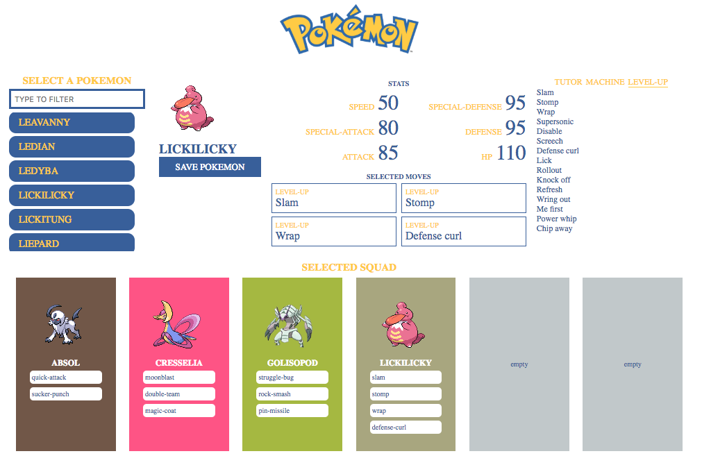

# New Front-End Developer

> Host your version of this repository on [Github](https://github.com/), [Bitbucket](https://bitbucket.org/), [Gitlab](https://gitlab.com/) or another platform. Make sure it's publicly available. Share the link to the finished exercise.

This is an exercise to test your **HTML**, **CSS**, **JavaScript** and **React** knowledge. Limit the time you spend on this exercise to 3 hours. Don't worry if you're unable to finish in time. You should, however, be able to explain how you would finish the exercise — and why you would do it that way — if you're given more time. Remember, there is **no correct solution**. There will be plenty of time during the interview to give context to the shortcuts you made.

- [Introduction](#introduction)
- [Specifications](#specifications)
- [Technical details](#technical-details)
- [Design details](#design-details)

## Introduction

To keep things light — and because the API is publicly available — you'll be working with Pokémon 🎉. The goal is to develop a single-page application (SPA) that allows you to:

- [Select a Pokémon](#select-a-pokémon)
- [Select moves](#select-the-moves) for that Pokémon to learn (limited to 4 moves)
- [Add the selected Pokémon to your squad](#add-to-your-squad) (limited to 6 Pokémon)



## Specifications

### Select a Pokémon

Use the [GraphQL API](#graphql-api) to get a list of all Pokémon. Add a text input to filter the list. Pokémon whose name match — or partially match — the input value remain visible. All other Pokémon have to be removed from the list. Clicking a Pokémon marks it as selected and displays it in the details section.

### Select the moves

Use the [GraphQL API](#graphql-api) to get the selected Pokémon's details: name, image, stats, abilities and type. Present the stats in a 2x3 grid. Divide the moves (abilities) by way of learning: level-up, tutor, egg and machine. Note that not all Pokémon have all 4 types of moves. Clicking a move adds it to the list of selected moves. Clicking an already selected move removes it from the list. Limit the number of moves to 4.

### Add to squad

Add a "Save Pokémon" button. Clicking the button adds the selected Pokémon — with its selected moves — to your squad. Limit the squad to 6 Pokémon.

## Technical details

The master branch is your starter kit for the exercise. Clone it and run `yarn` followed by `yarn start`. This should present you with a ready-to-go application. Use the _src_ and _public_ folder to edit or add code.

**Note**: the package.json includes a predefined set of dependencies. **Feel free to add or remove packages** as needed. Use as much open source components as you like. We recommend [Downshift](https://github.com/paypal/downshift) for the autocomplete UI. You can use [Sass](https://sass-lang.com/), [CSS Modules](https://github.com/css-modules/css-modules) or [styled-components](https://styled-components.com/) for styling. As long as you're able to justify your choices nothing is off limits.

### Prerequisites

This exercise requires [Node >= 12](https://nodejs.org/en/) and [Yarn 1](https://yarnpkg.com/lang/en/).

### Commands

The build command will bundle all assets and output a static version of the website in the _build_ folder. The start command will serve the website and watch for changes.

- install: `yarn`
- build: `yarn build`
- start: `yarn start`

### GraphQL API

The GraphQL endpoint URL is `https://p5k91xxvoq.sse.codesandbox.io/`. It's available in your application as `process.env.REACT_APP_POKE_ENDPOINT`. You can use the [Graphql playground](https://p5k91xxvoq.sse.codesandbox.io/) as a documentation resource or to get familiar with the API.

You'll need two queries to build your application: one for listing all Pokémons and one for getting a Pokémon's details:

#### Pokémon List

```gql
Pokemons(first: 151) {
  id
  name
}
```

#### Pokémon Details

```gql
Pokemon(name: "snorlax") {
  id
  name
  image
  abilities {
    name
  }
  stats {
    name
    value
  }
  types {
    name
  }
}
```

## Design Details

The base colors are:

- Blue: `#3a5d9f`
- Yellow: `#fdcc07`
- White: `#ffffff`
- Grey: `#c1c8ca`

The Pokémon type colors are:

- Normal Type: `#a8a77a`
- Fire Type: `#ee8130`
- Water Type: `#6390f0`
- Electric Type: `#f7d02c`
- Grass Type: `#7ac74c`
- Ice Type: `#96d9d6`
- Fighting Type: `#c22e28`
- Poison Type: `#a33ea1`
- Ground Type: `#e2bf65`
- Flying Type: `#a98ff3`
- Psychic Type: `#f95587`
- Bug Type: `#a6b91a`
- Rock Type: `#b6a136`
- Ghost Type: `#735797`
- Dragon Type: `#6f35fc`
- Dark Type: `#705746`
- Steel Type: `#b7b7ce`
- Fairy Type: `#d685ad`
